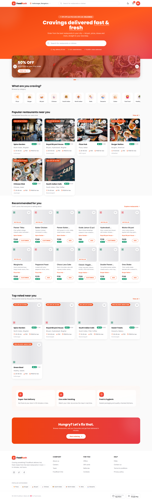
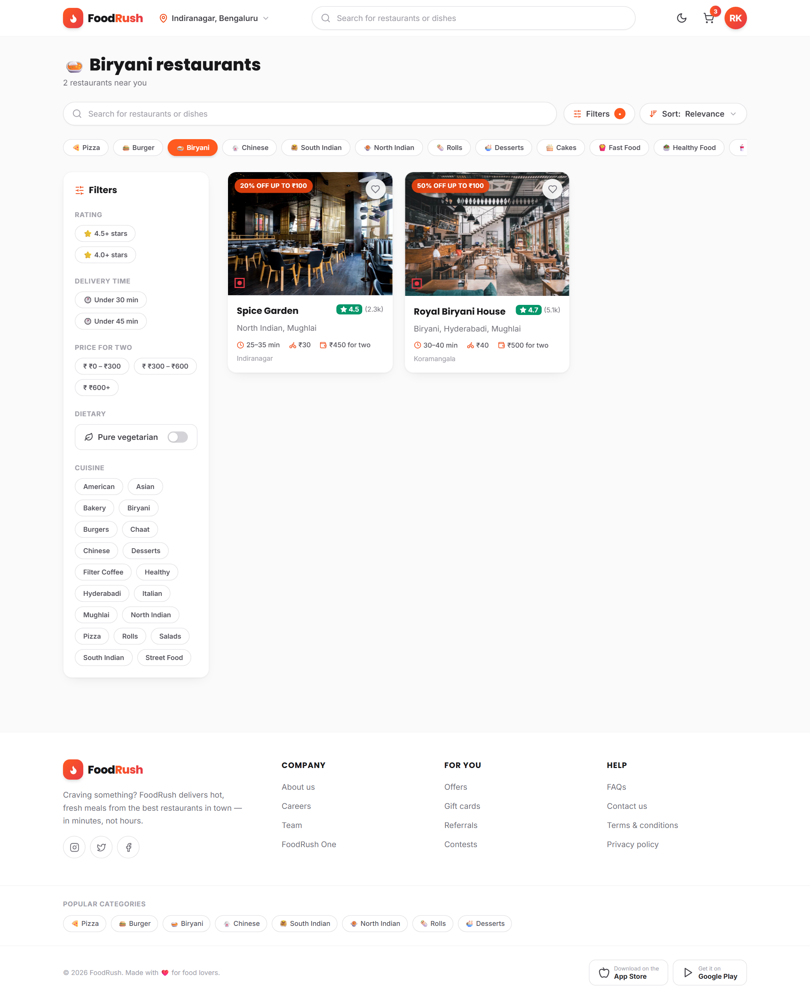
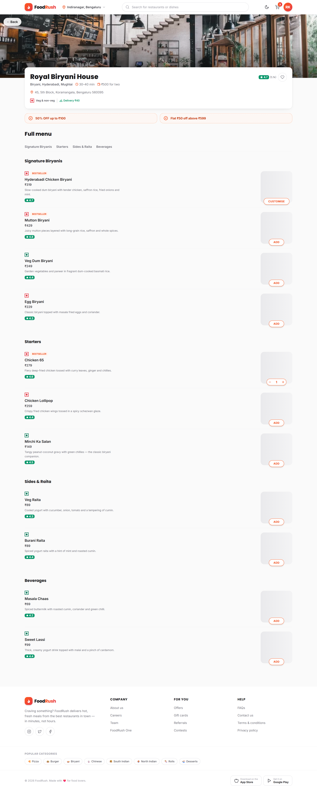
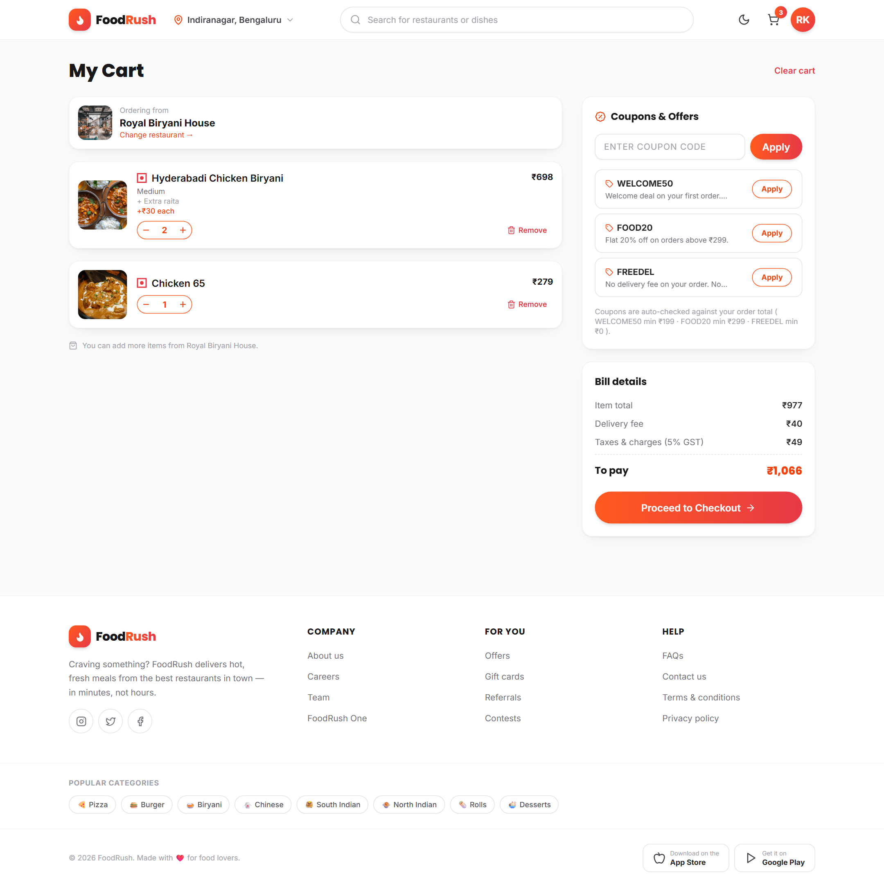
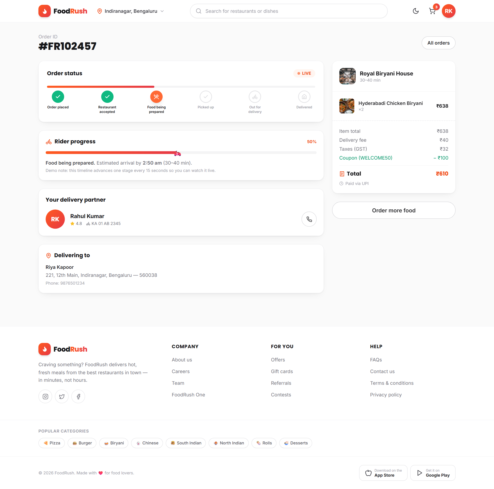
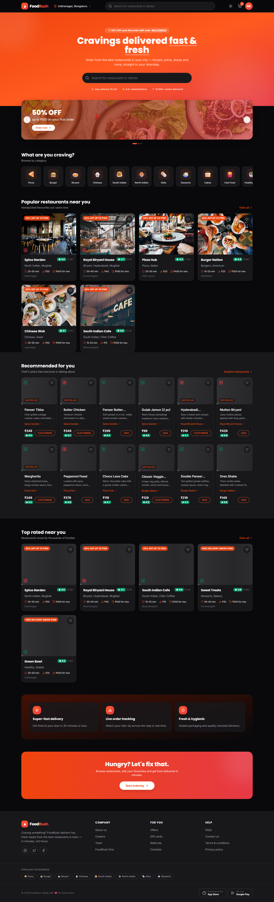
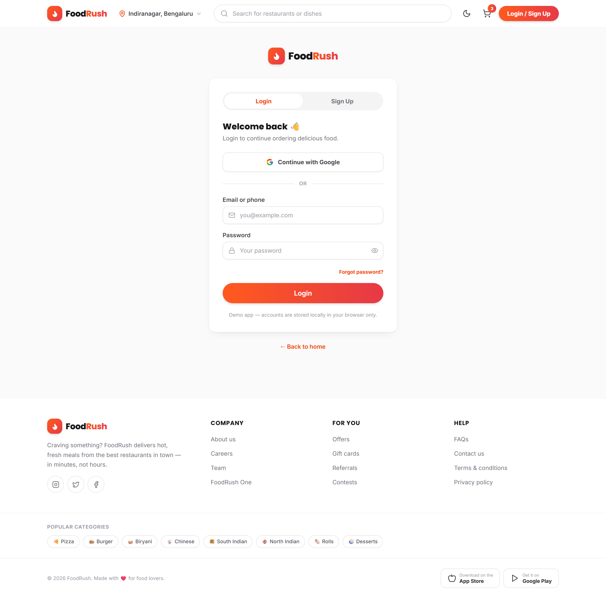

<div align="center">

# 🍕 FoodRush

**A full-stack food delivery platform — React + Express + MongoDB**

Order biryani, pizza, dosas and more from your favourite restaurants with live order tracking, coupons, and a complete admin & restaurant workflow.

</div>

---

## ✨ Highlights

| | |
|---|---|
| **Customer app** | 11 pages: home, search & filters, restaurant menu, food customisation, cart, checkout, live order tracking, profile, orders, login |
| **Dark mode** | Class-based Tailwind theme with a pre-paint script (no flash), follows your system preference |
| **Coupons** | `WELCOME50` (50% off up to ₹100), `FOOD20` (20% off up to ₹150), `FREEDEL` (free delivery) — validated against order totals |
| **Full-stack ready** | Express REST API + Mongoose models for Users, Restaurants, Foods, Orders, Addresses, Coupons, Categories & Reviews |
| **JWT auth** | Register / login / logout with bcrypt password hashing and protected routes |
| **Mobile-first** | Sticky navbar, bottom navigation, no horizontal overflow at 390px, tested in headless Chrome |
| **Polished UX** | Loading skeletons, empty & error states, toasts, micro-animations, veg/non-veg indicators |

## 🖼️ Screenshots

<p float="left">
  
  
</p>
<p float="left">
  
  
</p>
<p float="left">
  
  
</p>
<p float="left">
  
</p>

## 🛠️ Tech Stack

**Frontend** — React 18 · React Router 6 · Tailwind CSS 3 · Vite 5 · lucide-react
**Backend** — Node.js · Express · Mongoose · JSON Web Tokens · bcryptjs · MongoDB
**Tooling** — Vite build · E2E verified with Puppeteer + headless Chrome

## 📁 Project Structure

```
.
├── src/                  # React frontend
│   ├── components/       #   reusable UI (navbar, cards, modals, skeletons…)
│   ├── context/          #   cart, auth, favourites, orders, addresses, settings, toasts
│   ├── data/             #   mock data (also seeds the database)
│   ├── hooks/            #   localStorage, fake-loading
│   ├── pages/            #   11 pages
│   └── utils/            #   pricing, formatting, image helpers
├── backend/              # Express REST API
│   ├── src/
│   │   ├── config/       #   DB connection (env-configurable)
│   │   ├── controllers/  #   request handlers
│   │   ├── middleware/   #   JWT auth, error handling
│   │   ├── models/       #   Mongoose schemas
│   │   ├── routes/       #   API routes
│   │   ├── utils/        #   helpers
│   │   └── scripts/      #   database seeding
│   └── server.js         #   Express entry point
├── scripts/              # API test suite
├── screenshots/          # README images
└── index.html
```

## 🚀 Getting Started

### Frontend (works standalone with mock data)

```bash
npm install
npm run dev        # http://localhost:5173
```

### Backend (Express + MongoDB)

```bash
cd backend
npm install
npm run seed       # loads restaurants/foods/categories/coupons + demo users into MongoDB
npm run dev        # http://localhost:5000
```

> **No MongoDB installed?** The backend auto-starts an in-memory MongoDB
> (`mongodb-memory-server`) when `MONGO_URI` is not set, so it runs immediately.
> For a real database, create a free [MongoDB Atlas](https://www.mongodb.com/atlas)
> cluster and set `MONGO_URI` in `backend/.env` (see `.env.example`).

### Demo accounts (created by the seed script)

| Role | Email | Password |
|---|---|---|
| Customer | `demo@foodrush.app` | `demo123` |
| Admin | `admin@foodrush.app` | `admin123` |
| Restaurant owner | `owner@foodrush.app` | `owner123` |
| Delivery partner | `delivery@foodrush.app` | `delivery123` |

## 🔌 REST API

| Method | Endpoint | Description | Auth |
|---|---|---|---|
| POST | `/api/auth/register` | Create account | — |
| POST | `/api/auth/login` | Login → JWT | — |
| GET | `/api/auth/me` | Current user | ✅ |
| POST | `/api/auth/forgot-password` | Request reset link | — |
| POST | `/api/auth/reset-password/:token` | Set new password | — |
| GET | `/api/categories` | All categories | — |
| GET | `/api/restaurants` | List + search/filter/sort (`category`, `cuisine`, `rating`, `pureVeg`, `sort`) | — |
| GET | `/api/restaurants/:slug` | Restaurant + menu grouped by section | — |
| GET | `/api/foods?search=` | Search dishes across restaurants | — |
| GET | `/api/coupons` | Available coupons | — |
| POST | `/api/coupons/validate` | Preview a coupon's discount | — |
| GET/POST | `/api/addresses` | List / create addresses | ✅ |
| PATCH/DELETE | `/api/addresses/:id` | Update / delete address | ✅ |
| GET/POST | `/api/orders` | List my orders / place an order (prices recomputed server-side) | ✅ |
| GET | `/api/orders/:id` | Order details (owner / admin / restaurant / assigned delivery) | ✅ |
| PATCH | `/api/orders/:id/status` | Advance status (role-gated) or cancel | ✅ |
| POST | `/api/orders/:id/reorder` | Rebuild cart from a past order | ✅ |
| GET | `/api/orders/admin/dashboard` | Users / restaurants / orders / revenue stats | admin |
| GET | `/api/orders/restaurant/mine` | A restaurant owner's incoming orders | restaurant |
| GET | `/api/orders/delivery/available` | Orders awaiting a delivery partner | delivery |
| POST | `/api/orders/delivery/accept/:id` | Accept a delivery | delivery |
| GET/POST | `/api/reviews` | List reviews / write one (after delivery) | ✅ |
| POST | `/api/restaurants` · `/api/foods` | Admin CRUD for restaurants & foods | admin |

## 🧭 Roadmap

- [x] **Phase 1** — Stable, tested frontend on GitHub
- [x] **Phase 2–3** — Express API + MongoDB with seeded data
- [x] **Phase 2–3** — Express API + MongoDB with seeded data
- [x] **Phase 4** — Real auth: register / login / JWT / protected routes / forgot & reset password
- [x] **Phase 5 (API)** — Orders, addresses, reorder, favourites & role-gated status pipeline
- [x] **Phase 12 (API)** — Reviews with rating aggregation & delivered-order gate
- [x] **Phase 13 (API)** — Automated endpoint test suite (`npm run test:api`, 65 checks)
- [ ] **Phase 4–5 (UI)** — Wire the React app to the API (real auth, orders, addresses)
- [ ] **Phase 6** — Admin dashboard (restaurant & food management, order pipeline)
- [ ] **Phase 7** — Restaurant owner dashboard
- [ ] **Phase 8** — Payment gateway (UPI / cards / net-banking, keep COD)
- [ ] **Phase 9** — Real-time tracking with Socket.IO
- [ ] **Phase 10** — Delivery partner dashboard
- [ ] **Phase 11** — Maps & location services
- [ ] **Phase 13** — Frontend unit & component tests
- [ ] **Phase 14** — Deploy (Vercel + Render/Railway + MongoDB Atlas)

## ✅ Testing

**API** (`cd backend && npm run test:api`) — 65 checks across every endpoint:
auth (register/login/phone login/forgot+reset), role permissions, coupon
validation, order placement with server-side price recomputation (unit price +
add-ons + customisations + GST + coupon), the full restaurant → delivery status
pipeline, admin CRUD, and reviews.

**Customer journey** — verified end-to-end in headless Chrome: signup → search →
restaurant → customised dish → cart → coupon → checkout → order placement → live
tracking → reorder, plus favourites persistence, veg mode, dark mode and mobile
layout (390px, no horizontal overflow, no console errors).

## 📝 Notes

- Frontend runs standalone on mock data + `localStorage`; the Express API mirrors
  the same data model so the UI can be wired to it without redesign.
- Payments, SMS/email delivery and real-time updates are simulated in the frontend
  demo and are on the roadmap for the backend.
